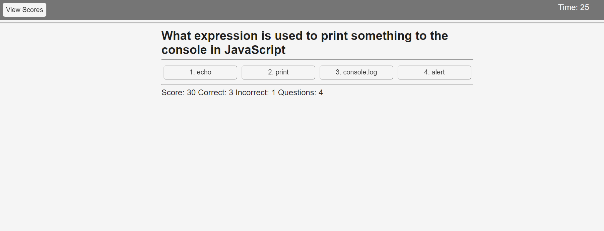

# Coding Quiz

## Purpose

This web application provides a timed quiz that a user can take and save their scores on in order to learn the content.

## Functionality

* The application displays the provided questions in a random order.

* The quiz ends when the timer runs out or the user answers all questions.

* The possible answers to each question are displayed in a randomized order.

* When the quiz is over the user is given the opportunity to save their score under a name or nickname.

* Saved scores persist after the page has been closed or refreshed. 

* The user can view the saved scores ranked from highest to lowest score.

* When the clear scores button is pressed local storage is cleared of scores.

* During the quiz the application keeps track of how many questions the user has gotten right and wrong.

* When a question is answered incorrectly ten seconds are subtracted from the timer.

* When a question is answered correctly ten points are added to the score.

* An incorrect answer will turn red when clicked.

* A correct answer will turn green when clicked.

## Application Preview

Here is a preview of the web application after generating a password.

